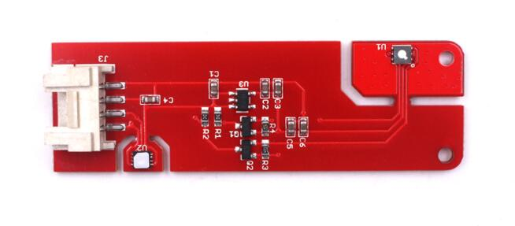

# Mabee Module Serial

```c++
/*
Version:		V1.1
Author:			Vincent
Create Date:	2022/10/15
Note:
		2022/10/15	V1.1: Add readme
*/
```


[toc]

# Makerfabs

[Makerfabs home page](https://www.makerfabs.com/)

[Makerfabs Wiki](https://makerfabs.com/wiki/index.php?title=Main_Page)

# Mabee Module List

- Mabee CO2
- Mabee 6Aixs IMU MPU6050
- Mabee Button
- Mabee DHT11 sensor
- Mabee Relay 10A
- Mabee Serial WiFi
- Mabee Servo SG90
- Mabee Slide Potentimeter
- Mabee WS2812 8bit


## Mabee CO2



This Mabee module is an air quality monitor. Based on SGP30, this module provides TVOC(Total Volatile Organic Compounds) and CO2eq output; Based on the Sensirion temperature/ humidity sensors SHT31, it output highest-accuracy ±2% relative humidity and ±0.3°C accuracy temperature.

Product Link ：[Mabee_TVOC and eCO2 SGP30 & Temperature and Humidity SHT31](https://www.makerfabs.com/mabee-tvoc-and-eco2-sgp30-sht31.html)

Wiki Link : [Mabee_CO2](https://www.makerfabs.com/wiki/index.php?title=Mabee_CO2)

## Mabee 6Aixs IMU MPU6050

This Mabee_ MPU6050 Accelerometer& Gyro has 3-Axis digital accelerometer and 3-Axis gyroscope, suitable for common motion capturing of acceleration and Orientation.

Product Link ：[Mabee_6Aixs IMU MPU6050](https://www.makerfabs.com/mabee-6aixs-imu-mpu6050.html)

## Mabee Button

A simple button with Cap for digital inputs, with Mabee Interface for easy usage.

Product Link ：[Mabee_Button](https://www.makerfabs.com/mabee-button.html)

## Mabee DHT11 sensor

Mabee_Temperature& Humidity DHT11 is high quality, low-cost digital temperature, and humidity sensor based on the DHT11 module, which is the most commonly used sensor for temperature& Humidity, it is widely favored by hardware enthusiasts for its advantages such as low power consumption and excellent long-term stability.

Product Link ：[Mabee_Temperature& Humidity DHT11](https://www.makerfabs.com/mabee-dht11.html)

## Mabee Relay 10A

A Relay module used to control high voltage& big current circuits On/Off. It is a digital normally open switch that controls a relay capable of switching much higher voltages and currents than your normal Arduino boards. When the relay is switched on, the LED will light up and the relay will allow current to flow. The peak voltage capability is 250V at 10A.

Product Link ：[Mabee_Relay 10A](https://www.makerfabs.com/mabee-relay-10a.html)

## Mabee Serial WiFi

This Mabee Serial Wifi is based on ESP-12S, to make the WiFi available for more hardware platforms such as the Pi Pico.

Product Link ：[Mabee_Serial WiFi](https://www.makerfabs.com/mabee-serial-wifi.html)

## Mabee Servo SG90

A simple& cheap Servo module with Mabee interface, for starters to learn the servo usage and basic applications.

Product Link ：[Mabee_Servo SG90](https://www.makerfabs.com/mabee-servo-sg90.html)

## Mabee Slide Potentimeter

Do you still remember your physics class in junior middle school, about the potentiometer? The slide potentiometer could be the most basic impression for a "potentiometer".

Product Link ：[Mabee_Slide Potentiometer](https://www.makerfabs.com/mabee-slide-potentiometer.html)

## Mabee WS2812 8bit

8 pcs of WS2812 RGB LED easily for panel mounting with Mabee interface. 2 Mabee interface Input& Output, for multiple cascading.

Product Link ：[Mabee_WS2812_8bit](https://www.makerfabs.com/mabee-ws2812-8bit.html)


